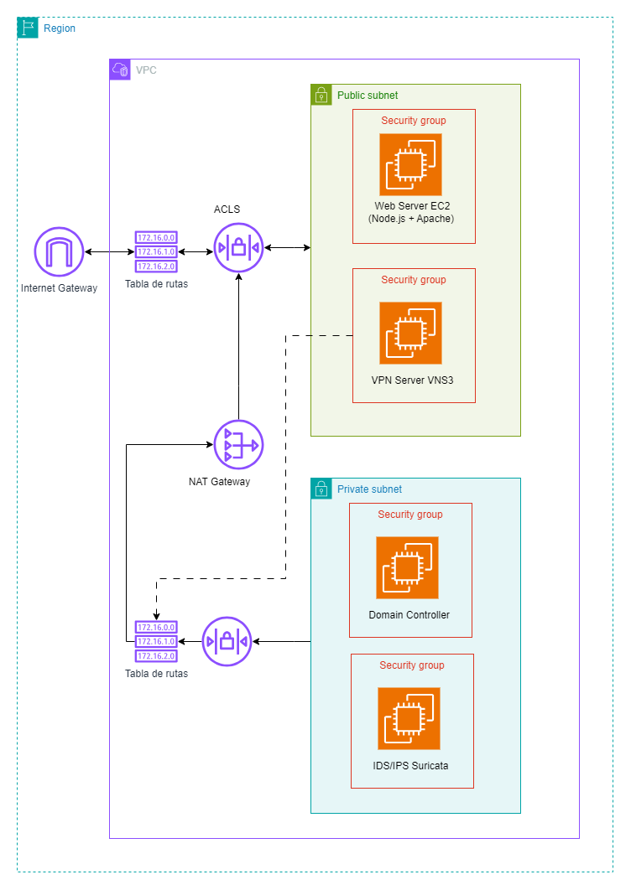
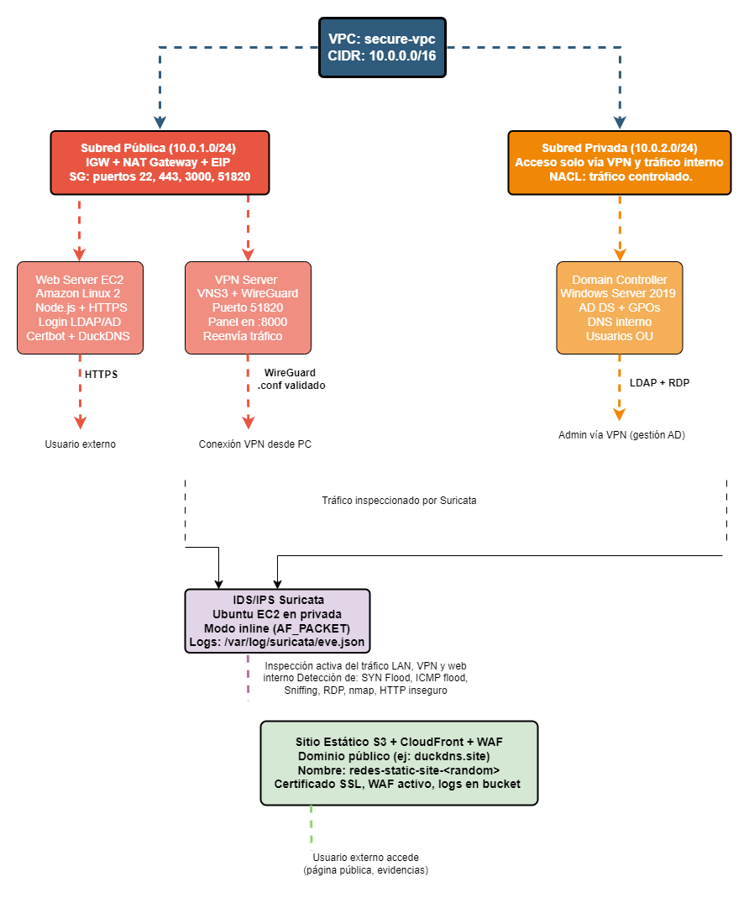

# 🔐 Proyecto de Seguridad en Redes TCP/IP en AWS con Terraform

Este repositorio contiene la infraestructura como código (IaC) para desplegar una red informática segura en la nube de Amazon Web Services (AWS), como parte del curso de **Seguridad de Redes TCP/IP**. El proyecto cumple con todos los requisitos técnicos definidos: incluye segmentación de red, autenticación centralizada, IDS/IPS, acceso privado mediante VPN, firewall, acceso público controlado y simulación de ataques.

---

## 🧠 Descripción General

El diseño de esta infraestructura parte de una arquitectura modular implementada con Terraform, permitiendo la automatización y control total de recursos. Cada componente —servidores, red, seguridad— fue desplegado como un módulo independiente, lo que facilita su mantenimiento, replicabilidad y escalabilidad.

Se utilizaron servicios clave de AWS como EC2, S3, VPC, y se integraron soluciones de código abierto como Suricata, WireGuard y Active Directory para construir una red funcional y segura.

---

## 🗂️ Fases implementadas

### 🧱 Fase 1: Red Base
- VPC `10.0.0.0/16` con subred pública `10.0.1.0/24` y privada `10.0.2.0/24`
- Internet Gateway, NAT Gateway, tablas de ruteo, NACLs y SGs
- Infraestructura completamente modularizada con Terraform

### 🌐 Fase 2: Servidor Web Seguro
- EC2 con Amazon Linux 2023
- Backend en Node.js integrado con Active Directory mediante LDAP
- Certificado HTTPS emitido por Let's Encrypt usando DuckDNS
- Acceso público cifrado y validado

### 🗃️ Fase 3: Sitio Estático en S3
- Bucket configurado con `aws_s3_bucket_website_configuration`
- Página HTML accesible públicamente
- Logs habilitados y configurados

### 🏢 Fase 4: Servidor de Dominio (Active Directory)
- EC2 con Windows Server 2019
- Configuración de AD DS y DNS
- Dominio `project-redes.local` con OUs, GPOs, grupos y usuarios definidos
- Autenticación centralizada para toda la red

### 🛡️ Fase 5: IDS/IPS con Suricata
- EC2 Ubuntu 22.04 configurada como IDS y luego como IPS inline
- Reglas personalizadas en `local.rules`
- Logs generados en `/var/log/suricata/eve.json`
- Detección y bloqueo de escaneo, SYN Flood, sniffing, etc.

### 🔒 Fase 6: VPN y Firewall con VNS3
- EC2 con VNS3 (AMI oficial de Cohesive Networks)
- VPN tipo WireGuard (puerto UDP 51820)
- Reglas FORWARD y POSTROUTING para filtrado de tráfico
- Bloqueo de redes sociales y NAT Gateway integrado

### 🧪 Fase 7: Simulación de Ataques
- DDoS (ICMP flood) desde IP pública y privada
- SYN Flood simulados con `hping3`
- Sniffing de credenciales HTTP con Suricata
- Logs y alertas verificadas y documentadas

---

## 🧩 Infraestructura requerida (verificada)

| Componente                       | Estado    |
|----------------------------------|-----------|
| Servidor Web (Apache/IIS)        | ✅ Cumplido |
| Pagina de Login                  | ✅ Cumplido |
| Servidor de Dominio + AD         | ✅ Cumplido |
| Firewall (VNS3)                  | ✅ Cumplido |
| IDS / IPS (Suricata)             | ✅ Cumplido (documentar logs) |
| Accesos Publicos (Web, RDP)      | ✅ Cumplido |
| Accesos Privados (VPN)           | ✅ Cumplido |
| Segmentacion y SGs especificos   | ✅ Cumplido |
| Infra modular y documentada      | ✅ Cumplido |

---


## 📊 Diagramas de Infraestructura

### Diagrama de Arquitectura General



### Diagrama Conceptual de Componentes



---

## 📁 Estructura del Proyecto

```bash
.
├── main.tf
├── variables.tf
├── outputs.tf
├── provider.tf
├── modules/
│   ├── vpc/
│   ├── networking/
│   ├── web_server/
│   ├── windows_domain_server/
│   ├── ids_ubuntu/
│   ├── vns3_firewall/
│   └── s3_static_site/
├── environments/
├── diagramas/
│   ├── arquitectura.png
│   └── conceptual.png
├── user.sh
├── comandos.sh
├── suricata.yaml
├── redes-key.pem / redes-key.pub
└── dev.tfvars
```

---

## ⚙️ Requisitos para Despliegue

- Terraform v1.3 o superior
- Cuenta de AWS con permisos EC2, S3, VPC, IAM
- Clave SSH (`redes-key.pem`)
- AMIs definidas en `dev.tfvars`

---

## 🚀 Despliegue

```bash
terraform init
terraform apply -var-file="dev.tfvars"
```

⚠️ Revisa cuidadosamente el archivo `dev.tfvars` antes de aplicar.

---

## 🧹 Eliminación de Recursos

```bash
terraform destroy -var-file="dev.tfvars"
```

---

## 🧠 Buenas Prácticas Aplicadas

- Autenticación centralizada (LDAP + Active Directory)
- Segmentación lógica de red
- Mínima exposición de puertos
- Registros y alertas generadas por Suricata
- Infraestructura como código modular (IaC)
- Filtrado de contenido y reglas por subred
- HTTPS obligatorio para servicios expuestos

---

## 🧠 Notas finales

- Todos los servidores estan desplegados en la region `us-east-1`
- El diseño es modular y facilmente escalable
- Puedes extender esta infraestructura para integrar balanceadores, ACM, o monitoreo con CloudWatch

---
## 👨‍💻 Autor

**Darwin Rubelcy Lopez Sanchez**  
Proyecto: *Aseguramiento de una Red Informática*  
Desarrollado para el curso Seguridad de Redes TCP/IP  
Infraestructura implementada 100% con Terraform y AWS  
